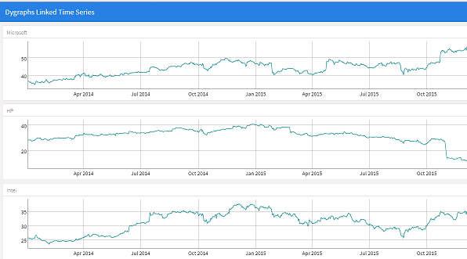

## Preview - Overview of Discussion

 - Overview of HTML Widgets
 - HTML Widgets Examples
 - Advance: HTML Widgets in Shiny / R Markdown
 - Target Audience
 - Goal of webinar
 
  

   
   
 

Tornadoes!!!
--------------------

</a>
   
 

- [Video](https://www.wthr.com/article/watch-video-shows-tornado-destroying-kokomo-starbucks)

## Tornado Analysis

- [NOAA / National Weather Service Shapefile ](http://www.spc.noaa.gov/gis/svrgis/)
- [Reading spatial files into R with rgdal ](https://cran.r-project.org/web/packages/rgdal/index.html)
- [Leaflet Example ](http://rstudio.github.io/leaflet/)
 
## HTML Widgets &mdash; R Bindings to JavaScript Libraries

- Used at the R console for data analysis just like conventional R plots (via RStudio Viewer).
- Seamlessly embedded within R Markdown documents and Shiny web applications.
- Saved as standalone web pages for ad-hoc sharing via email, Dropbox, etc.

## Common Excel Tasks - rpivotTable & DT

- [rpivotTable - Package created by Enzo Martoglio](https://github.com/smartinsightsfromdata/rpivotTable)
- [DT: An R interface to the DataTables library by RStudio](https://rstudio.github.io/DT/)

## rbokeh Example

- [Bike Share Stations ](http://data.indy.gov)
- [rbokeh gmap](http://ryanhafen.com/blog/rbokeh-gmap)

</a> 

## Dygraphs Example

- [FRED® Economic Data](https://fred.stlouisfed.org/series/WASH911UR/downloaddata)
- [quantmod](http://www.quantmod.com/examples/intro/)

</a> 

## Leaflet Example

- [Leaflet Example ](http://rstudio.github.io/leaflet/)
- [All Starbucks Locations in the US](https://opendata.socrata.com/Business/All-Starbucks-Locations-in-the-US-Map/ddym-zvjk)
- [opendata.socrata.com](https://opendata.socrata.com/)

</a> 

## HTML Widgets &mdash; Leaflet Example

- Viewing Starbucks Locations
- Loads Data Sets

## HTML Widgets &mdash; Dygraphs in Shiny & RMarkdown

- [flexdashboard Example](http://rmarkdown.rstudio.com/flexdashboard/)

## Q/A...

</a>

## Additional Resources

 - Shiny Developer Center - http://shiny.rstudio.com
 - [Stack Overflow - "shiny" tag](http://stackoverflow.com/questions/tagged/shiny)
 - ["Shiny Discuss" Mailing List](https://groups.google.com/d/forum/shiny-discuss)
 - ***Come meet us!***
 
## Come see us at the RStudio Conference...

- [Austin January 15th through the 18th 2019](https://www.rstudio.com/conference/)
- https://github.com/rstudio/rstudio-conf/tree/master/2018

</a>

